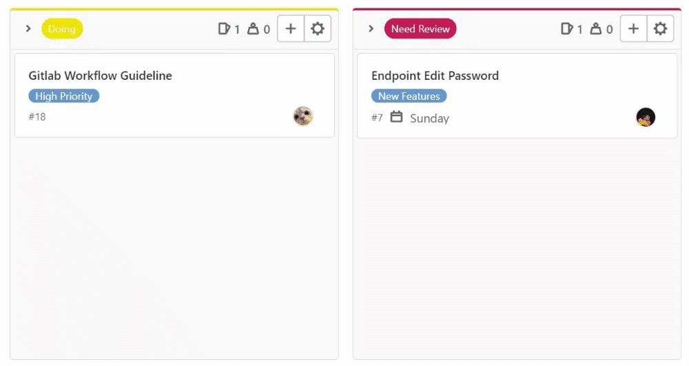

# Mini Project Development Guideline
**Development guideline adalah dokumen berisi tata cara, dokumentasi yang isinya berdasarkan ide dari semua anggota team, di-maintenance oleh tech lead, dan disetujui oleh seluruh anggota team dengan tujuan agar setiap anggota dalam satu team memiliki pandangan yang sama terkait bagaimana project ini akan berjalan.**

## [TODO] Table of Contents  
## [TODO] Get Started

## [WIP] Gitlab Workflow
1. Pindahkan issue yang sudah di-assign ke kamu dari card `current sprint` ke card `doing`
   
    
1. Masuk kedalam local repository kamu, lalu pindah ke branch `development` dan selalu `pull` dari branch tersebut agar perubahan di local repository kamu mengikuti data terbaru.
2. Buatlah branch baru dengan nama `features/features-name`. Buatlah branch yang benar-benar bisa menjelaskan fitur mana yang sedang kamu kerjakan, contoh : `features/login`, `features/lupa-password`.
3. Setiap commit yang kamu buat pastikan benar benar menjelaskan tentang apa yang kamu kerjakan.
  - Contoh commit yang baik : `Create endpoint login using jwt token`
  - Contoh commit yang buruk : `commit`, `firhan sudah`, `sudah selesai`, `login`, `kurang sedikit`.
5. Setelah kamu selesai silahkan pastikan tidak ada error di pekerjaanmu lalu `push` pekerjaan kamu ke remote repository dengan branch yang sama dengan branch yang kamu buat di local repository.
6. Buatlah Merge Request dengan detail sebagai berikut :

    
  
    - Title : nama fitur yang kamu kerjakan
    - Description : #kode issue, tambahkan penjelasan jika memang dibutuhkan
    - Assignees : ternakkode
    - Reviewers : ternakkode
    - Milestone : Sesuaikan Sprint (Sprint 1/2/3/dst)
    - Label : bisa dikosongi (Jika Merge Requestnya Urgent silahkan tambahkan High Priority)
    - Merge Options : delete source branch when merge request is accepted
    
7. Pindahkan issue kamu di board dari `doing` ke `need review` agar maintainer bisa mengecek merge request kamu dengan mudah.
   
    
8. Setelah itu selalu pantau issue board, jika `card` yang kamu buat pindah dari `need review` ke `done` maka pekerjaan kamu telah dianggap selesai, namun jika terpindah di `current sprint` dengan tambahan label `need revision` maka cek ulang `merge request` yang kamu buat atau hubungi maintainer untuk memastikan perbaikan seperti apa yang harus dilakukan.


## [WIP] Enviroment & Libaries
- bcrypt
- dotenv
- express-validator
- jsonwebtoken
- nanoid
- passport
- passport-jwt
- pg
- sequelize
  
## [TODO] Database Schema

## [WIP] Project Structure / File Grouping

### Visualisasi
```bash
├── config
|   ├── database.js
├── database
|   ├── migrations
|   ├── models
|   ├── seeders
|   ├── connection.js
├── helpers
|   ├── response.js
├── middleware
|   ├── middleware-name.js
├── routes
|   ├── api
|   |   ├── index.js
|   |   ├── feature-name
|   |   |   ├── feature-name.route.js
|   |   |   ├── feature-name.controller.js
├── utils
|   ├── jwt.js
|   ├── bcrypt.js
```

### Penjelasan 

- Folder `config` digunakan untuk menyimpan konfigurasi yang akan digunakan pada project ini, contohnya adalah konfigurasi untuk server database
- Folder `database` digunakan untuk menyimpan keperluan database. 
  - Terdapat 1 file bernama `connection.js` yaitu file untuk koneksi ke server postgreSQL menggunakan Sequelize.
  - Terdapat 3 folder yang digunakan yaitu : 
    - `Migration` : untuk blueprint atau skema database dari tabel yang akan dibuat.
    - `Models` : untuk object modeling tiap tabel yang ada di database.
    - `Seeders` : untuk mengisi data default / dummy pada tabel yang ada di database.
- Folder `guideline` digunakan untuk menyimpan media yang diperlukan untuk membuat guideline ini (tidak berhubugnan dengan project).
- Folder `helpers` digunakan untuk menyimpan shortcut dari **function** yang sering dipakai di beberapa tempat dan menggunakan dependency dari module lain. Contoh dari helpers adalah untuk membuat jwt token dari payload yang diberikan di parameter dan menggunakan libraries/module dari jsonwebtoken
- Folder `middleware` digunakan untuk menyimpan semua middleware yang akan digunakan pada **REST API**. Contoh dari middleware adalah middleware untuk **validasi jwt token**, **error handling**.
- [WIP] Folder `routes` digunakan untuk menyimpan endpoint pada project.
- Folder `utils` digunakan untuk menyimpan helpers yang memperlukan dependencies lain. contohnya adalah format response API pada semua endpoint sama, maka dari itu kita membuat utils untuk merubah 2 parameter yang diberikan menjadi sebuah object yang sesuai dengan standart yang sudah ditentukan diawal.

## [TODO] Coding Style