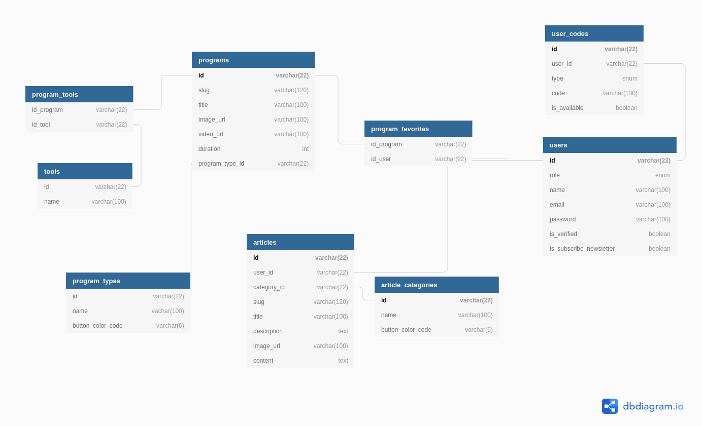

# Mini Project Development Guideline
**Development guideline adalah dokumen berisi tata cara, dokumentasi yang isinya berdasarkan ide dari semua anggota team, di-maintenance oleh tech lead, dan disetujui oleh seluruh anggota team dengan tujuan agar setiap anggota dalam satu team memiliki pandangan yang sama terkait bagaimana project ini akan berjalan.**
## Get Started
``` bash
# copy .env.example ke .env
$ cp .env.example .env
# jangan lupa untuk edit lagi file .env menyesuaikan konfigurasi database postgresql di server masing2

# install packages
$ npm install

# buat database dari konfigurasi
$ sequelize db:create

# migrasi tabel
$ sequelize db:migrate

# seeding dummy data & default data
$ sequelize db:seed

# jalankan api pada local server anda :
$ npm run dev
```
## [WIP] Gitlab Workflow
1. Pindahkan issue yang sudah di-assign ke kamu dari card `current sprint` ke card `doing`
   
    
1. Masuk kedalam local repository kamu, lalu pindah ke branch `development` dan selalu `pull` dari branch tersebut agar perubahan di local repository kamu mengikuti data terbaru.
2. Buatlah branch baru dengan nama `feature/feature-name`. Buatlah branch yang benar-benar bisa menjelaskan fitur mana yang sedang kamu kerjakan, contoh : `feature/login`, `feature/forget-password`.
3. Setiap commit yang kamu buat pastikan benar benar menjelaskan tentang apa yang kamu kerjakan.
  - Contoh commit yang baik : `Create endpoint login using jwt token`
  - Contoh commit yang buruk : `commit`, `firhan sudah`, `sudah selesai`, `login`, `kurang sedikit`.
5. Setelah kamu selesai silahkan pastikan tidak ada error di pekerjaanmu lalu `push` pekerjaan kamu ke remote repository dengan branch yang sama dengan branch yang kamu buat di local repository.
6. Buatlah Merge Request dengan detail sebagai berikut :

    
  
    - Title : nama fitur yang kamu kerjakan
    - Description : #kode issue, tambahkan penjelasan jika memang dibutuhkan
    - Assignees : ternakkode
    - Reviewers : ternakkode
    - Milestone : Sesuaikan Sprint (Sprint 1/2/3/dst)
    - Label : bisa dikosongi (Jika Merge Requestnya Urgent silahkan tambahkan High Priority)
    - Merge Options : delete source branch when merge request is accepted
    
7. Pindahkan issue kamu di board dari `doing` ke `need review` agar maintainer bisa mengecek merge request kamu dengan mudah.
   
    
8. Setelah itu selalu pantau issue board, jika `card` yang kamu buat pindah dari `need review` ke `done` maka pekerjaan kamu telah dianggap selesai, namun jika terpindah di `current sprint` dengan tambahan label `need revision` maka cek ulang `merge request` yang kamu buat atau hubungi maintainer untuk memastikan perbaikan seperti apa yang harus dilakukan.


## [WIP] Dependency Libraries
- @sendgrid/mail
- bcrypt
- crypto-js
- dotenv
- express-validator
- jsonwebtoken
- nanoid
- passport
- passport-jwt
- pg
- sequelize
  
## Database Schema

## [WIP] Project Structure / File Grouping

### Visualisasi
```bash
├── config
|   ├── database.js
├── database
|   ├── migrations
|   ├── models
|   ├── seeders
|   ├── connection.js
├── helpers
|   ├── response.js
├── middleware
|   ├── middleware-name.js
├── routes
|   ├── api
|   |   ├── index.js
|   |   ├── feature-name
|   |   |   ├── feature-name.route.js
|   |   |   ├── feature-name.controller.js
├── utils
|   ├── jwt.js
|   ├── bcrypt.js
```

### Penjelasan 

- Folder `config` digunakan untuk menyimpan konfigurasi yang akan digunakan pada project ini, contohnya adalah konfigurasi untuk server database
- Folder `database` digunakan untuk menyimpan keperluan database. 
  - Terdapat 1 file bernama `connection.js` yaitu file untuk koneksi ke server postgreSQL menggunakan Sequelize.
  - Terdapat 3 folder yang digunakan yaitu : 
    - `Migration` : untuk blueprint atau skema database dari tabel yang akan dibuat.
    - `Models` : untuk object modeling tiap tabel yang ada di database.
    - `Seeders` : untuk mengisi data default / dummy pada tabel yang ada di database.
- Folder `guideline` digunakan untuk menyimpan media yang diperlukan untuk membuat guideline ini (tidak berhubugnan dengan project).
- Folder `helpers` digunakan untuk menyimpan shortcut dari **function** yang sering dipakai di beberapa tempat dan menggunakan dependency dari module lain. Contoh dari helpers adalah untuk membuat jwt token dari payload yang diberikan di parameter dan menggunakan libraries/module dari jsonwebtoken
- Folder `middleware` digunakan untuk menyimpan semua middleware yang akan digunakan pada **REST API**. Contoh dari middleware adalah middleware untuk **validasi jwt token**, **error handling**.
- Folder `routes` digunakan untuk menyimpan endpoint pada project. Untuk detailnya silahkan cek di Coding Style bagian Controller & Route.
- Folder `utils` digunakan untuk menyimpan helpers yang memperlukan dependencies lain. contohnya adalah format response API pada semua endpoint sama, maka dari itu kita membuat utils untuk merubah 2 parameter yang diberikan menjadi sebuah object yang sesuai dengan standart yang sudah ditentukan diawal.

## [WIP] RESTful API Design

### URL Design
Jangan gunakan kata kerja untuk mendefinisikan url pertama pada sebuah REST API melainkan gunakan kata kerja dan juga gunakan kata benda jamak.

**Berikut ini adalah contoh penamaan yang baik :**
- `/users/`
- `/programs/`
- `/articles/`
- dll

**Pada url kedua dan seterusnya baru gunakan kata kerja & kebab-case, contoh :**
- `/users/register`
- `/users/login`
- `/users/forgot-password`
- `/users/verification`

**Jika ingin membuat CRUD maka gunakan HTTP Method yang biasa digunakan pada REST API, contoh :**
- GET `/users`, Untuk mengambil semua data user.
- GET `/users/1`, Untuk mengambil data user dengan ID `1`
- POST `/users`, Untuk membuat user baru
- PUT `/photos/1`, Untuk merubah user dengan ID `1`
- DELETE `/photos/1`, Untuk menghapus user dengan ID `1`

### Response Format
- Response sucess api dengan mengembalikan 1 data berupa object
  
  ```json
  {
    "success": true,
    "message": "This is successful message",
    "data": {
        "id": 1,
        "type": "articles",
        "created_at": "2019-10-04 14:33"
    }
  }
  ```

- Response sucess api dengan mengembalikan beberapa data berupa array of object
  
  ```json
  {
    "success": true,
    "message": "This is successful message",
    "data": [
        {
            "id": 1,
            "type": "articles",
            "created_at": "2019-10-04 13:33"
        },
        {
            "id": 2,
            "type": "articles",
            "created_at": "2019-10-04 14:33"
        }
    ]
  }
  ```

- Response success api tanpa mengembalikan data apapun (hanya message)
  
  ```json
  {
    "success": true,
    "message": "This is successful message",
  }
  ```

- Response failed api normal
  
  ```json
  {
    "success": false,
    "message": "Error xyz has occurred"
  }
  ```

- Response failed api pada proses validasi request payload

  ```json
  {
      "success": false,
      "message": "Error xyz has occurred",
      "errors": [
          "The email must be a valid email",
          "The password must be at least 6 chaarcters",
          "The phone number is already used"
      ],
  }
  ```

## [WIP] Coding Style

- ### **Route & Controller Flow**
  ```javascript
  // lokasi file : routes/api/index.js
  const api = require('express').Router();
  const errorHandlingApi = require('../../middleware/errorHandlingApi');
  
  /*
  Taruh Routemu disini dengan aturan sebagai berikut : 
  1. syntax api.use('/url', require('.nama-fitur/nama-fitur.route))
  2. Urutkan sesuai abjad, jika route yang kamu buat diawali dengan huruf f dan ada route diawali huruf e maka route yang diawali huruf f diatas route yang diawali huruf e
  3. 1 Route di file index.js tidak digunakan untuk 1 endpoint saja melainkan banyak endpoint, contoh :
    a. Fitur login & register tidak perlu dibuatkan masing2 1 file disini melainkan cukup file auth saja lalu nanti fitur login & register bisa dimasukkan kedalam file auth/auth.route.js
    b. Untuk kasus CRUD sama dengan kasus sebelumnya.
  */
  api.use('/example', require('./example/example.route'));
  
  api.use(errorHandlingApi);
  
  module.exports = api;  
  ```

  ```javascript
  // contoh sub route untuk CRUD
  // lokasi file : routes/api/nama-fitur/nama-fitur.js
  const namaFiturRoute = require('express').Router();
  const namaFiturController = require('./nama-fitur.controller');
  
  namaFiturRoute.get('/', namaFiturController.index);
  namaFiturRoute.get('/:params', namaFiturController.detail);
  namaFiturRoute.post('/', namaFiturController.create);
  namaFiturRoute.put('/:params', namaFiturController.update);
  namaFiturRoute.delete('/:params', namaFiturController.delete);

  module.exports = namaFiturRoute;  
  ```

- ### **Controller Method** (Contohnya bisa dilihat pada folder routes/api/example.example.controller.js)
  
  ```javascript
  /*
  Terdapat module method yang harus selalu di require pada setiap controller file
    1. ApiErrorHandler class dengan lokasi helpers/ApiErrorHandler.js
    2. Method successApi dengan lokasi utils/response.js
  */

  // selalu buat function asynchronous
  const controllerMethodName = async (req, res, next) => {
    try {
      // masukkan logic code
      
      // contoh error handling :
      if (somethingIdontWantIsHappen) {
        // ubah angka 400 menjadi http code sesuai jenis error yang terjadi
        throw new ApiErrorHandler(400, "error message");
      }

      /* mengirim response ke user 
      Keterangan : 
       - http status tidak selalu 200, bisa 201 atau lainnya
       - payload bisa diisi ataupun tidak, jadi kita tidak ada data yang dikirimkan cukup panggil utils successApi dengan 1 parameter, contoh : successApi("berhasil berhasil hore")
      */
      res.status(200).json(
        successApi("pesan response", payload)
      );
    } catch (err) {
      // kirimkan error untuk dihandle oleh error handling middleware
      next(err);
    }
  }

  // export all controller as an object :
  module.exports {
    controllerMethodName
  }
  ```

- ### **Validation Middleware**
  
  1. Buat file baru pada folder `helpers/validation/rules` sesuai fitur yang kamu buat. contoh : `users`
  2. tambahankan kode `const { check } = require('express-validator');` pada bagian paling atas kode kamu.
  3. Buat array baru untuk validation rules tiap endpoint yang kamu buat.
  4. import validation rule helpers dan file `middleware/requestValidation` lalu tambahkan 2middleware tersebut pada endpoint yang kamu buat.
  5. Selalu buat custom error message dengan menambahkan method `withMessage('pesan error')`setelah validation rule, contoh :
    dalam kasus ini, ketika nama tidak diisi api akan otomatis mengirimkan response ke user dengansalah satu data errornya `name should not empty`.
  ```javascript
    check('name')
      .notEmpty().withMessage('should not empty')
      .isString().withMessage('should be string')
  ```

  6. Contoh penerapannya bisa kamu cek pada file `helpers/validation/rules/users.js` untuk contoh validation rulesnya dan `routes/api/users/users.route.js` untuk contoh penggunaannya sebagai middleware.
  7. Jika kamu bingung validation rules apa saja yang bisa dimasukan berikut beberapa contoh umumnya : 
    - Cek apakah data dikirimkan menggunakan method `notEmpty()`
    - Cek apakah data dikirimkan dengan format string menggunakan method `isString()`
    - Memastikan data dikirimkan adalah foreign key salah satu model : 
  
      ```javascript
        check('user_id')
        .notEmpty().withMessage('should not empty')
        .custom(value => {
          return User.findByPk(value).then(user => {
            if (!user) {
              return Promise.reject('user not found');
            }
          });
        }),
      ```
- ### Penggunaan Middleware
  Contoh Penerapan :
  developer `a` ingin membuat endpoint yang dimana usernya harus `login terlebih dahulu`, `sudah verifikasi email`, `memiliki role admin`, dan `data yang dikirimkan telah tervalidasi oleh validation middleware`. maka untuk penerapannya bisa sebagai berikut

  ```javascript 
  // file feature.route.js
  featureNameRoute = require('express').Router();

  featureNameController = require('./feature-name.controller');
  /* require semua middleware yang ingin dipakai */
  const featureNameValidationRule = require('../../../helpers/validation/rules/featureNameValidationRule');
  const requestValidationMiddleware = require('../../../middleware/requestValidation');
  const jwtMiddleware = require('../../../middleware/jwtPassport');
  const isVerified = require('../../../middleware/isVerified');
  const verifyRoles = require('../../../middleware/verifyRoles');

  ...
    featureNameRoute.get(
      '/',
      jwtMiddleware, // jwt middleware akan dipanggil terlebih dahulu ketika mengakses dan menyimpan data user pada property req.user
      isVerified, // is verified akan dipanggil kedua
      verifyRoles(['admin']), // verifyRoles akan dipanggil ketiga,
      featureNameValidationRule.index, // disini sistem akan mengecek inputan user apakah sudah sesuai dengan rule yang dibuat atau belum, jika ada yang tidak sesuai sistem otomatis menyimpan property errors pada request body untuk di proses pada middleware selanjutnya
      requestValidationMiddleware, // jika menemukan property errors middleware ini akan langsung throw error ke ApiErrorHandler untuk mengirimkan http response.
      featureNameController.index // setelah semua verifikasi berhasil proses terakhir adalah di sisi controller untuk memproses request client.
    );
    /* Note :
        Jika pada salah satu middleware ada kegagalan pada proses verifikasinya maka sistem tidak akan melanjutkan proses ke middleware selanjutnya, contoh : Ketika user gagal pada verifikasi jwt menggunakan jwtMiddleware maka sistem otomatis mengirimkan http response tanpa melalui middleware selanjutnya seperti isVerified, verifyRoles, dst seperti pada contoh sebelumnya.
  ...
  ```
### **Database & Model Design**
- **Penamaan Table** : lowercase, snake_case, plural. contoh :
  - `users`
  - `user_code`
  - `articles`
- **Penamaan ORM Model** : PascalCase, singular. contoh :
  - `User`
  - `UserCode`
  - `Article` 

- **[TODO] Sequelize Best Practice**